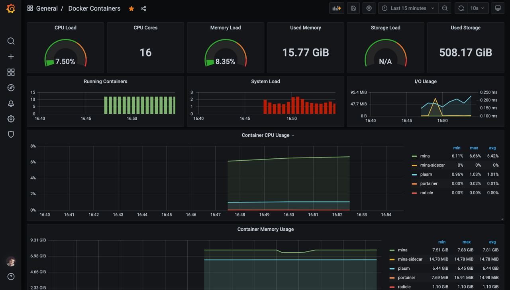
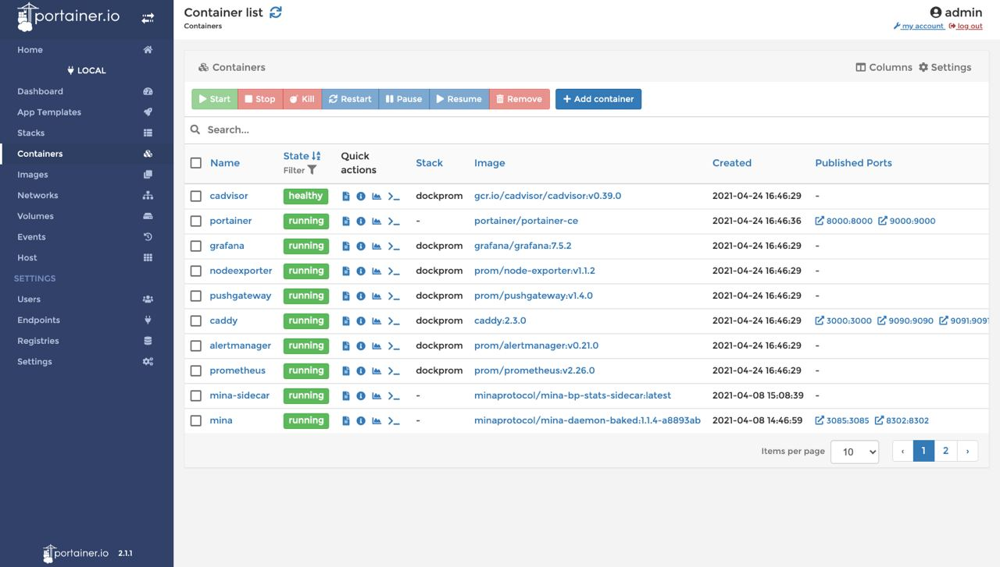

# Build and launch 🛠

Install `git`, `docker` and `docker-compose`.

Git clone this repository:

```
git clone https://github.com/garik-code/docker-admin
```

Run bash script:

```
bash install.sh
```

---

# Using 👏


## Grafana: 

`http://localhost:3000/`

Login and password: admin




## Portainer 

`http://localhost:9000/`

Login and password: admin




## Start

```
bash start.sh
```


## Stop

```
bash stop.sh
```
